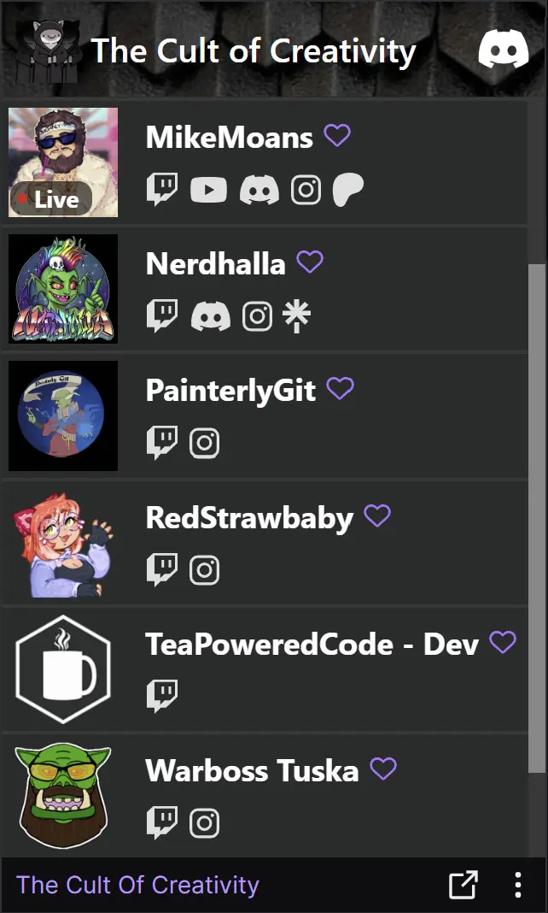

# The Cult Of Creativity - Twitch panel

A custom team panel for twitch with options for ui customisation and links to many socials.



#### Setup 
 - npm install
 - Move rename ./templates/SettingsTemplate.js to ./src/Settings.js
   Set the RootURL and UIFolder values to url where the config files are stored
 ```
    export const Settings = Object.freeze({
        RootURL: "",
        UIPath: "",
        ConfigFile: "",
        LiveCheckInterval: 120,
    });
```
#### Dev 
 - npx serve ./src   
(chrome no longer allows embedding of insecure localhost , this stops you using localhost for dev purposes for twitch extension.  
You'll either need to host the files somewhere or use something like ngrox to open a secure connection to your localhost. You will need make sure to update the 'Asset hosting' value on Developers console)

 - npx tailwindcss -i ./tailwind-input.css -o ./src/core.css --watch

#### Config
For this project they wanted strict admin control  
The solution I chose for this was to store a json config file and custom ui files on a branch on github.
This way editing can be locked down to select admins and I can vet any changes before merging changes and check css values.

```json
{
    "GroupName": "",
    "Discord": "",
    "Website": "",
    "Users": 
    [
        {
            "Info": {
                "Name": "",
                "Twitch": "" 
            },
            "UI" : {                     // optional to allow for custom UI  
                "BannerBackground": "",  // optional banner image
                "CSS": ""                // optional css file
            },
            "Links":{
                "Youtube": "",
                "Discord": "",
                "Instagram" : "",
                "Patreon": "",
                "Linktree": ""
            }
        },
        ...
    ]
}
```

If you want to create a custome css file copy and rename the src/custome.css  
Make you style changes , update the config.file and upload the css file to the config location.

